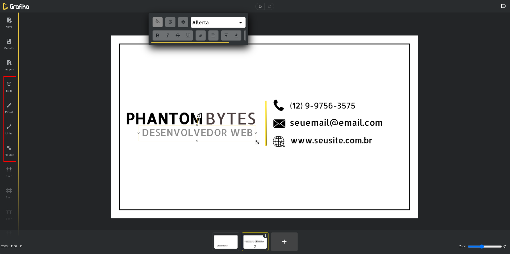
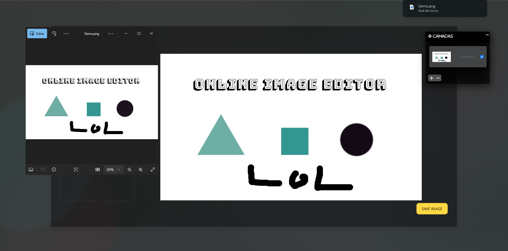

# Grafika

Bem-vindo ao Grafika! O Grafika é um editor de canvas desenvolvido com HTML, CSS, jQuery e o framework Konva.js. Com ele, você pode criar e editar imagens diretamente no navegador de maneira simples e intuitiva.
[Demo](https://marceloarc.github.io/editor-de-imagem/)
---

## Recursos
- **Texto**: Adicione e edite textos com opções de fonte, tamanho e cor.
- **Figuras Geométricas**: Insira formas como retângulos, círculos e polígonos com controles de tamanho e cores.
- **Desenho**: Utilize o pincel para criar desenhos livres.
- **Camadas**: Gerencie elementos de forma organizada com a funcionalidade de camadas.
- **Imagens**: Adicione e redimensione imagens dentro do editor.
- **Download**: Exporte seu projeto finalizado como uma imagem (PNG ou JPEG).
- **Personalização**: Redimensione e reposicione elementos com facilidade.

---

## Como Usar

### 1. Configurar o Editor
1. Acesse o editor no seu navegador.
2. Escolha as dimensões do canvas ao clicar no botão "Novo Projeto".

### 2. Adicionar Elementos
- Clique nas ferramentas para adicionar:
  - **Texto**
  - **Figuras geométricas**
  - **Imagens**
  - **Desenho livre**
  - **Linhas**

### 3. Personalizar Elementos
- Selecione um elemento para ajustar:
  - **Tamanho**
  - **Cor**
  - **Posição**
  - **Conteúdo do texto**

### 4. Gerenciar Paginas
- Utilize o painel de paginas para reordenar, ocultar ou excluir elementos específicos.

### 5. Modelos e projetos
- Carregue seu projeto modificavel ou use um dos modelos disponiveis.

### 6. Exportar Imagem
- VocÊ pode baixar as paginas em formato de imagem ou salvar em formato de projeto para continuar depois.

---

## Exemplos

### Adicionando Texto e Formas
📷

### Gerenciando Paginas
📷 

### Exportando o Projeto
📷 

---

## Tecnologias Utilizadas
- **HTML**
- **CSS**
- **jQuery**
- **Konva.js**

---

## Contribuições
Contribuições são bem-vindas! Sinta-se à vontade para abrir um **Pull Request** ou relatar um problema em **Issues**.

---

## Contato
Se você tiver dúvidas, sugestões ou problemas, entre em contato:
- **Email**: [marceloaugusto96@hotmail.com](mailto:marceloaugusto96@hotmail.com)
- **LinkedIn**: [Marcelo Correa](https://www.linkedin.com/in/marcelo-augusto-b44489178/)

